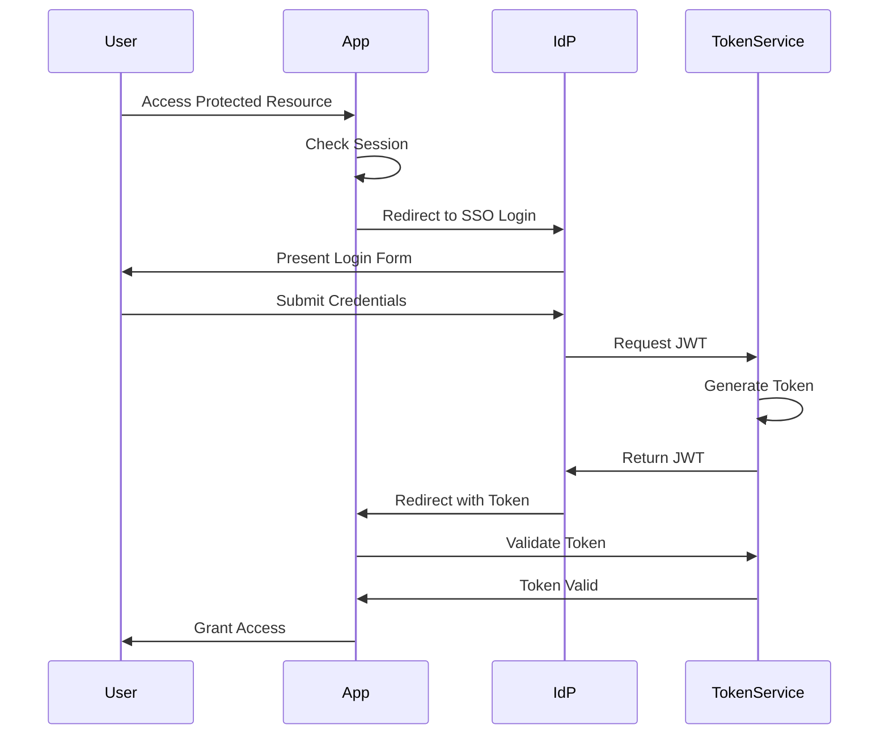

# SSO Integration Overview

## Purpose and Benefits

Single Sign-On (SSO) integration provides a seamless authentication experience while enhancing security across our application ecosystem. 

Key benefits include:
- **Simplified User Experience**: Users authenticate once to access multiple applications
- **Enhanced Security**: Centralized authentication with strong security controls
- **Reduced Password Fatigue**: Eliminates need for multiple credentials
- **Streamlined Access Management**: Centralized user provisioning and deprovisioning
- **Improved Compliance**: Standardized authentication logging and audit trails

## Security Architecture

Our SSO implementation follows industry best practices with a robust security architecture:

### Components
1. **Identity Provider (IdP)**
   - Handles user authentication
   - Issues security tokens
   - Maintains user identity information

2. **Service Provider (Our Application)**
   - Validates security tokens
   - Manages user sessions
   - Enforces access controls

3. **Token Service**
   - Issues and validates JWT tokens
   - Manages token lifecycle
   - Implements token security measures

## JWT Token Implementation

Our system uses JSON Web Tokens (JWT) for secure information exchange:

### Token Structure
```json
{
  "header": {
    "alg": "RS256",
    "typ": "JWT"
  },
  "payload": {
    "sub": "user-id",
    "iss": "identity-provider",
    "aud": "our-application",
    "exp": 1735689600,
    "iat": 1735685000,
    "auth_time": 1735685000,
    "scope": ["read", "write"],
    "roles": ["user", "admin"]
  }
}
```

### Security Measures
- RS256 asymmetric signing algorithm
- Short token expiration (1 hour)
- Mandatory token validation
- Secure token storage

## Authentication Flow



## Token-based Authentication Approach

Our token-based authentication system:
1. Generates secure JWT tokens upon successful authentication
2. Validates tokens on each request
3. Manages token rotation and revocation
4. Implements token refresh mechanism

### Token Lifecycle
1. **Generation**: Created after successful authentication
2. **Storage**: Securely stored in HttpOnly cookies
3. **Validation**: Verified on each API request
4. **Renewal**: Automatic refresh before expiration
5. **Revocation**: Immediate invalidation when needed

## Redirect Flow Mechanics

1. **Initial Request**
   - User accesses protected resource
   - System checks for valid session

2. **SSO Redirect**
   - Application redirects to IdP
   - Includes return URL and state parameter
   - Preserves original request context

3. **Post-Authentication**
   - IdP redirects back to application
   - Includes security token
   - Application validates token and establishes session

## Security Best Practices

### Token Security
- Use secure token storage (HttpOnly cookies)
- Implement short token expiration
- Rotate tokens regularly
- Validate tokens thoroughly

### Authentication Security
- Enforce MFA where possible
- Implement rate limiting
- Monitor failed authentication attempts
- Log security events

### Session Management
- Secure session handling
- Automatic session timeout
- Concurrent session control
- Session invalidation on logout

### Data Protection
- Encrypt sensitive data in transit and at rest
- Use TLS 1.3 for all communications
- Implement secure key management
- Regular security audits

### Additional Considerations
1. **Compliance Requirements**
   - GDPR compliance for user data
   - SOC2 requirements for authentication
   - Industry-specific regulations

2. **Monitoring and Alerts**
   - Real-time security monitoring
   - Automated threat detection
   - Incident response procedures

3. **Disaster Recovery**
   - Backup authentication methods
   - Failover procedures
   - Service restoration plans

4. **Regular Updates**
   - Security patch management
   - Dependency updates
   - Regular security reviews
